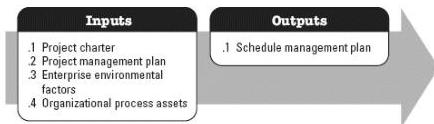

### 3.6 PLAN SCHEDULE MANAGEMENT

Plan Schedule Management is the process of establishing the policies, procedures, and documentation for planning, developing, managing, executing, and controlling the project schedule. The key benefit of this process is that it provides guidance and direction on how the project schedule will be managed throughout the project. This process is performed once or at predefined points in the project. The inputs and outputs of this process are depicted in Figure 3-7.

Figure 3-7. Plan Schedule Management: Inputs and Outputs

The needs of the project determine which components of the project management plan are necessary.

#### 3.6.1 PROJECT MANAGEMENT PLAN COMPONENTS

Examples of project management plan components that may be inputs for this process include but are not limited to:

- ◆ Scope management plan, and
- ◆ Development approach.

### 3.7 DEFINE ACTIVITIES

Define Activities is the process of identifying and documenting the specific actions to be performed to produce the project deliverables. The key benefit of this process is that it decomposes work packages into schedule activities that provide a basis for estimating, scheduling, executing, monitoring, and controlling the project work. This process is performed throughout the project. The inputs and outputs of this process are depicted in Figure 3-8.

548