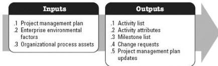

**Figure 3-8. Define Activities: Inputs and Outputs**

The needs of the project determine which components of the project management plan are necessary.

### 3.7.1 PROJECT MANAGEMENT PLAN COMPONENTS

Examples of project management plan components that may be inputs for this process include but are not limited to:

- ◆ Schedule management plan, and
- ◆ Scope baseline.

### 3.7.2 PROJECT MANAGEMENT PLAN UPDATES

Components of the project management plan that may be updated as a result of this process include but are not limited to:

- ◆ Schedule baseline, and
- ◆ Cost baseline.

## 3.8 SEQUENCE ACTIVITIES

Sequence Activities is the process of identifying and documenting relationships among the project activities. The key benefit of this process is that it defines the logical sequence of work to obtain the greatest efficiency given all project constraints. This process is performed throughout the project. The inputs and outputs of this process are depicted in Figure 3-9.

549