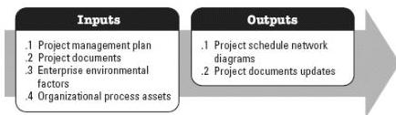

**Figure 3-9. Sequence Activities: Inputs and Outputs**

The needs of the project determine which components of the project management plan and which project documents are necessary.

### 3.8.1 PROJECT MANAGEMENT PLAN COMPONENTS

Examples of project management plan components that may be inputs for this process include but are not limited to:

- ◆ Schedule management plan, and
- ◆ Scope baseline.

### 3.8.2 PROJECT DOCUMENTS EXAMPLES

Examples of project documents that may be inputs for this process include but are not limited to:

- ◆ Activity attributes,
- ◆ Activity list,
- ◆ Assumption log, and
- ◆ Milestone list.

### 3.8.3 PROJECT DOCUMENTS UPDATES

Project documents that may be updated as a result of this process include but are not limited to:

- ◆ Activity attributes,
- ◆ Activity list,
- ◆ Assumption log, and
- ◆ Milestone list.

550