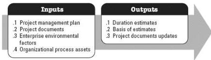

### 3.9 ESTIMATE ACTIVITY DURATIONS

Estimate Activity Durations is the process of estimating the number of work periods needed to complete individual activities with estimated resources. The key benefit of this process is that it provides the amount of time each activity will take to complete. This process is performed throughout the project. The inputs and outputs of this process are depicted in Figure 3-10.

Figure 3-10. Estimate Activity Durations: Inputs and Outputs

The needs of the project determine which components of the project management plan and which project documents are necessary.

#### 3.9.1 PROJECT MANAGEMENT PLAN COMPONENTS

Examples of project management plan components that may be inputs for this process include but are not limited to:

- Schedule management plan, and
- Scope baseline.

#### 3.9.2 PROJECT DOCUMENTS EXAMPLES

Examples of project documents that may be inputs for this process include but are not limited to:

- Activity attributes,
- Activity list,
- Assumption log,
- Lessons learned register,
- Milestone list,
- Project team assignments,
- Resource breakdown structure,
- Resource calendars,

551