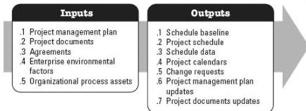

◆ Resource requirements, and
◆ Risk register.

### 3.9.3 PROJECT DOCUMENTS UPDATES

Project documents that may be updated as a result of this process include but are not limited to:

◆ Activity attributes,
◆ Assumption log,
◆ Lessons learned register.

### 3.10 DEVELOP SCHEDULE

Develop Schedule is the process of analyzing activity sequences, durations, resource requirements, and schedule constraints to create a schedule model for project execution and monitoring and controlling. The key benefit of this process is that it generates a schedule model with planned dates for completing project activities. This process is performed throughout the project. The inputs and outputs of this process are depicted in Figure 3-11.

Figure 3-11. Develop Schedule: Inputs and Outputs

The needs of the project determine which components of the project management plan and which project documents are necessary.

### 3.10.1 PROJECT MANAGEMENT PLAN COMPONENTS

Examples of project management plan components that may be inputs for this process include but are not limited to:

◆ Schedule management plan, and
◆ Scope baseline.

552