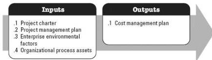

### 3.11 PLAN COST MANAGEMENT

Plan Cost Management is the process of defining how the project costs will be estimated, budgeted, managed, monitored, and controlled. The key benefit of this process is that it provides guidance and direction on how the project costs will be managed throughout the project. This process is performed once, or at predefined points in the project. The inputs and outputs of this process are depicted in Figure 3-12.

Figure 3-12. Plan Cost Management: Inputs and Outputs

The needs of the project determine which components of the project management plan are necessary.

#### 3.11.1 PROJECT MANAGEMENT PLAN COMPONENTS

Examples of project management plan components that may be inputs for this process include but are not limited to:

- Schedule management plan, and
- Risk management plan.

### 3.12 ESTIMATE COSTS

Estimate Costs is the process of developing an approximation of the monetary resources needed to complete project work. The key benefit of this process is that it determines the monetary resources required for the project. This process is performed periodically throughout the project as needed. The inputs and outputs of this process are depicted in Figure 3-13.

554