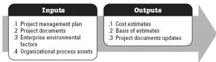

**Figure 3-13. Estimate Costs: Inputs and Outputs**

The needs of the project determine which components of the project management plan and which project documents are necessary.

### 3.12.1 PROJECT MANAGEMENT PLAN COMPONENTS

Examples of project management plan components that may be inputs for this process include but are not limited to:

- ◆ Cost management plan,
- ◆ Quality management plan, and
- ◆ Scope baseline.

### 3.12.2 PROJECT DOCUMENTS EXAMPLES

Examples of project documents that may be inputs for this process include but are not limited to:

- ◆ Lessons learned register,
- ◆ Project schedule,
- ◆ Resource requirements, and
- ◆ Risk register.

### 3.12.3 PROJECT DOCUMENTS UPDATES

Project documents that may be updated as a result of this process include but are not limited to:

- ◆ Assumption log,
- ◆ Lessons learned register, and
- ◆ Risk register.

555