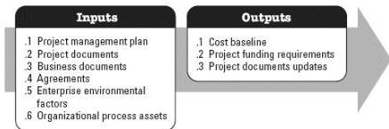

### 3.13 DETERMINE BUDGET

Determine Budget is the process of aggregating the estimated costs of individual activities or work packages to establish an authorized cost baseline. The key benefit of this process is that it determines the cost baseline against which project performance can be monitored and controlled. This process is performed once or at predefined points in the project. The inputs and outputs of this process are depicted in Figure 3-14.

Figure 3-14. Determine Budget: Inputs and Outputs

The needs of the project determine which components of the project management plan and which project documents are necessary.

#### 3.13.1 PROJECT MANAGEMENT PLAN COMPONENTS

Examples of project management plan components that may be inputs for this process include but are not limited to:

- Cost management plan,
- Resource management plan, and
- Scope baseline.

#### 3.13.2 PROJECT DOCUMENTS EXAMPLES

Examples of project documents that may be inputs for this process include but are not limited to:

- Basis of estimates,
- Cost estimates,
- Project schedule, and
- Risk register.

#### 3.13.3 PROJECT DOCUMENTS UPDATES

556