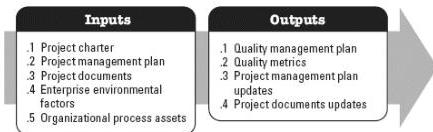

Project documents that may be updated as a result of this process include but are not limited to:

- Cost estimates,
- Project schedule, and
- Risk register.

### 3.14 PLAN QUALITY MANAGEMENT

Plan Quality Management is the process of identifying quality requirements and/or standards for the project and its deliverables, and documenting how the project will demonstrate compliance with quality requirements and/or standards. The key benefit of this process is that it provides guidance and direction on how quality will be managed and verified throughout the project. This process is performed once or at predefined points in the project. The inputs and outputs of this process are shown in Figure 3-15.

Figure 3-15. Plan Quality Management: Inputs and Outputs

The needs of the project determine which components of the project management plan and which project documents are necessary.

### 3.14.1 PROJECT MANAGEMENT PLAN COMPONENTS

Examples of project management plan components that may be inputs for this process include but are not limited to:

- Requirements management plan,
- Risk management plan,
- Stakeholder engagement plan, and
- Scope baseline.

### 3.14.2 PROJECT DOCUMENTS EXAMPLES

Examples of project documents that may be inputs for this process include but are not

557