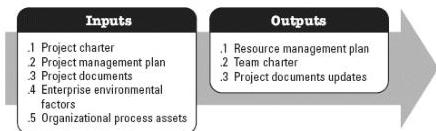

**Figure 3-16. Plan Resource Management: Inputs and Outputs**

The needs of the project determine which components of the project management plan and which project documents are necessary.

### 3.15.1 PROJECT MANAGEMENT PLAN COMPONENTS

Examples of project management plan components that may be inputs for this process include but are not limited to:

- ◆ Quality management plan, and
- ◆ Scope baseline.

### 3.15.2 PROJECT DOCUMENTS

Examples of project documents that may be inputs for this process include but are not limited to:

- ◆ Project schedule,
- ◆ Requirements documentation,
- ◆ Risk register, and
- ◆ Stakeholder register.

### 3.15.3 PROJECT DOCUMENTS UPDATES

Project documents that may be updated as a result of this process include but are not limited to:

- ◆ Assumption log, and
- ◆ Risk register.

### 3.16 ESTIMATE ACTIVITY RESOURCES

559