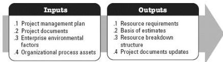

Estimate Activity Resources is the process of estimating team resources and the type and quantities of materials, equipment, and supplies necessary to perform project work. The key benefit of this process is that it identifies the type, quantity, and characteristics of resources required to complete the project. This process is performed periodically throughout the project as needed. The inputs and outputs of this process are depicted in Figure 3-17.

Figure 3-17. Estimate Activity Resources: Inputs and Outputs

The needs of the project determine which components of the project management plan and which project documents are necessary.

### 3.16.1 PROJECT MANAGEMENT PLAN COMPONENTS

Examples of project management plan components that may be inputs for this process include but are not limited to:

- Resource management plan, and
- Scope baseline.

### 3.16.2 PROJECT DOCUMENTS EXAMPLES

Examples of project documents that may be inputs for this process include but are not limited to:

- Activity attributes,
- Activity list,
- Assumption log,
- Cost estimates,
- Resource calendars, and
- Risk register.

### 3.16.3 PROJECT DOCUMENTS UPDATES

560