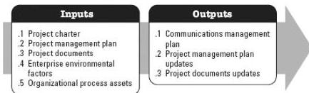

Project documents that may be updated as a result of this process include but are not limited to:

- ◆ Activity attributes,
- ◆ Assumption log,
- ◆ Lessons learned register.

### 3.17 PLAN COMMUNICATIONS MANAGEMENT

Plan Communications Management is the process of developing an appropriate approach and plan for project communication activities based on the information needs of each stakeholder or group, available organizational assets, and the needs of the project. The key benefit of this process is a documented approach to effectively and efficiently engage stakeholders by presenting relevant information in a timely manner. This process is performed periodically throughout the project as needed. The inputs and outputs of this process are depicted in Figure 3-18.

Figure 3-18. Plan Communications Management: Inputs and Outputs

The needs of the project determine which components of the project management plan and which project documents are necessary.

#### 3.17.1 PROJECT MANAGEMENT PLAN COMPONENTS

Examples of project management plan components that may be inputs for this process include but are not limited to:

- ◆ Resource management plan, and
- ◆ Stakeholder engagement plan.

#### 3.17.2 PROJECT DOCUMENTS EXAMPLES

Examples of project documents that may be inputs for this process include but are not limited to:

561