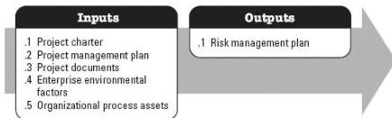

◆ Requirements documentation, and
◆ Stakeholder register.

### 3.17.3 PROJECT MANAGEMENT PLAN UPDATES

Components of the project management plan that may be updated as a result of this process include but are not limited to the stakeholder engagement plan.

### 3.17.4 PROJECT DOCUMENTS UPDATES

Project documents that may be updated as a result of this process include but are not limited to:

◆ Project schedule, and
◆ Stakeholder register.

### 3.18 PLAN RISK MANAGEMENT

Plan Risk Management is the process of defining how to conduct risk management activities for a project. The key benefit of this process is that it ensures that the degree, type, and visibility of risk management are proportionate to both the risks and the importance of the project to the organization and other stakeholders. This process is performed once or at predefined points in the project. The inputs and output of this process are depicted in Figure 3-19.

Figure 3-19. Plan Risk Management: Inputs and Outputs

The needs of the project determine which components of the project management plan and which project documents are necessary.

### 3.18.1 PROJECT MANAGEMENT PLAN COMPONENTS

In planning Project Risk Management, all available components of the project management plan should be taken into consideration in order to ensure risk management is

562