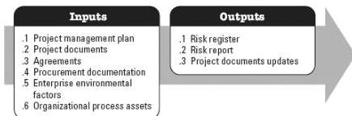

consistent with the needs of the project.

### 3.18.2 PROJECT DOCUMENTS EXAMPLES

An example of a project document that may be an input for this process includes but is not limited to the stakeholder register.

### 3.19 IDENTIFY RISKS

Identify Risks is the process of identifying individual project risks as well as sources of overall project risk, and documenting their characteristics. The key benefit of this process is the documentation of the existing individual project risks and the sources of overall project risk. It also brings together information so the project team can to respond appropriately to the identified risks. This process is performed throughout the project. The inputs and outputs of this process are depicted in Figure 3-20.

Figure 3-20. Identify Risks: Inputs and Outputs

The needs of the project determine which components of the project management plan and which project documents are necessary.

### 3.19.1 PROJECT MANAGEMENT PLAN COMPONENTS

Examples of project management plan components that may be inputs for this process include but are not limited to:

- Requirements management plan,
- Schedule management plan,
- Cost management plan,
- Quality management plan,
- Resource management plan,
- Risk management plan,

563