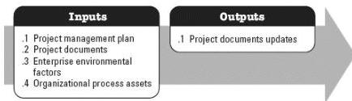

**Figure 3-21. Perform Qualitative Risk Analysis: Inputs and Outputs**

The needs of the project determine which components of the project management plan and which project documents are necessary.

### 3.20.1 PROJECT MANAGEMENT PLAN COMPONENTS

An example of a project management plan component that may be an input for this process includes but is not limited to the risk management plan.

### 3.20.2 PROJECT DOCUMENTS EXAMPLES

Examples of project documents that may be inputs for this process include but are not limited to:

- Assumption log,
- Risk register, and
- Stakeholder register.

### 3.20.3 PROJECT DOCUMENTS UPDATES

Project documents that may be updated as a result of this process include but are not limited to:

- Assumption log,
- Issue log,
- Risk register, and
- Risk report.

### 3.21 PERFORM QUANTITATIVE RISK ANALYSIS

Perform Quantitative Risk Analysis is the process of numerically analyzing the combined effect of identified individual project risks and other sources of uncertainty on overall

565