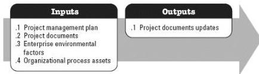

project objectives. The key benefit of this process is that it quantifies overall project risk exposure and can also provide additional quantitative risk information to support risk response planning. This process is performed throughout the project. The inputs and outputs of this process are depicted in Figure 3-22.

Figure 3-22. Perform Quantitative Risk Analysis: Inputs and Outputs

The needs of the project determine which components of the project management plan and which project documents are necessary.

### 3.21.1 PROJECT MANAGEMENT PLAN COMPONENTS

Examples of project management plan components that may be inputs for this process include but are not limited to:

- ◆ Risk management plan,
- ◆ Scope baseline,
- ◆ Schedule baseline, and
- ◆ Cost baseline.

### 3.21.2 PROJECT DOCUMENTS EXAMPLES

Examples of project documents that may be inputs for this process include but are not limited to:

- ◆ Assumption log,
- ◆ Basis of estimates,
- ◆ Cost estimates,
- ◆ Cost forecasts,
- ◆ Duration estimates,
- ◆ Milestone list,
- ◆ Resource requirements,
- ◆ Risk register,

566