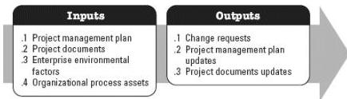

◆ Risk report, and
◆ Schedule forecasts.

# 3.21.3 PROJECT DOCUMENTS UPDATES

Project documents that may be updated as a result of this process include but are not limited to the risk report.

# 3.22 PLAN RISK RESPONSES

Plan Risk Responses is the process of developing options, selecting strategies, and agreeing on actions to address overall project risk exposure as well as to treat individual project risks. The key benefit of this process is that it identifies appropriate ways to address overall project risk and individual project risks. This process also allocates resources and inserts activities into project documents and the project management plan as needed. This process is performed throughout the project. The inputs and outputs of this process are depicted in Figure 3-23.

Figure 3-23. Plan Risk Responses: Inputs and Outputs

The needs of the project determine which components of the project management plan and which project documents are necessary.

# 3.22.1 PROJECT MANAGEMENT PLAN COMPONENTS

Examples of project management plan components that may be inputs for this process include but are not limited to:

◆ Resource management plan,
◆ Risk management plan, and
◆ Cost baseline.

# 3.22.2 PROJECT DOCUMENTS EXAMPLES

567