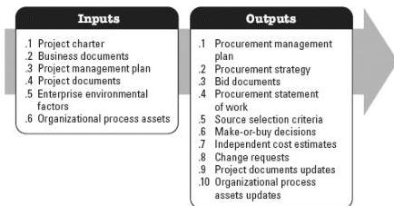

◆ Risk report.

### 3.23 PLAN PROCUREMENT MANAGEMENT

Plan Procurement Management is the process of documenting project procurement decisions, specifying the approach, and identifying potential sellers. The key benefit of this process is that it determines whether to acquire goods and services from outside the project and, if so, what to acquire as well as how and when to acquire it. Goods and services may be procured from other parts of the performing organization or from external sources. This process is performed once or at predefined points in the project. The inputs and outputs of this process are depicted in Figure 3-24.

Figure 3-24. Plan Procurement Management: Inputs and Outputs

The needs of the project determine which components of the project management plan and which project documents are necessary.

### 3.23.1 PROJECT MANAGEMENT PLAN COMPONENTS

Examples of project management plan components that may be inputs for this process include but are not limited to:

- ◆ Scope management plan,
- ◆ Quality management plan,
- ◆ Resource management plan, and
- ◆ Scope baseline.

### 3.23.2 PROJECT DOCUMENTS EXAMPLES

569