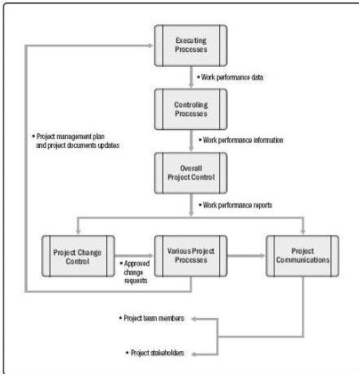

Figure 1-7. Project Data, Information, and Report Flow

### 1.2.5 TAILORING

Usually, project managers apply a project management methodology to their work. A methodology is a system of practices, techniques, procedures, and rules used by those who work in a discipline. This definition makes it clear that this guide itself is not a methodology.

This guide and *The Standard for Project Management* [1] are recommended references for tailoring, because these standard documents identify the subset of the project management body of knowledge that is generally recognized as good practice. “Good practice” does not mean that the knowledge described should always be applied uniformly to all projects. Specific methodology recommendations are outside the scope of this guide.

Project management methodologies may be:

- ◆ Developed by experts within the organization,
- ◆ Purchased from vendors,

57