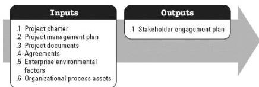

**Figure 3-25. Plan Stakeholder Engagement: Inputs and Outputs**

The needs of the project determine which components of the project management plan and which project documents are necessary.

### 3.24.1 PROJECT MANAGEMENT PLAN COMPONENTS

Examples of project management plan components that may be inputs for this process include but are not limited to:

- ◆ Resource management plan,
- ◆ Communications management plan, and
- ◆ Risk management plan.

### 3.24.2 PROJECT DOCUMENTS EXAMPLES

Examples of project documents that may be inputs for this process include but are not limited to:

- ◆ Assumption log,
- ◆ Change log,
- ◆ Issue log,
- ◆ Project schedule,
- ◆ Risk register, and
- ◆ Stakeholder register.

571