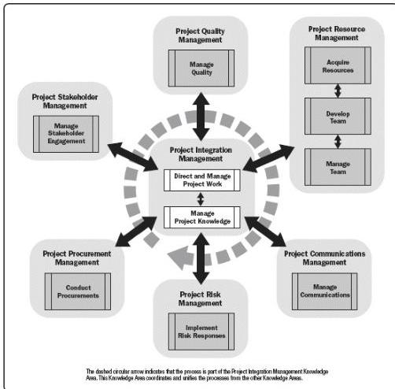

Figure 4-1. Executing Process Group

#### 4.1 DIRECT AND MANAGE PROJECT WORK

Direct and Manage Project Work is the process of leading and performing the work defined in the project management plan and implementing approved changes to achieve the project's objectives. The key benefit of this process is that it provides overall management of the project work and deliverables, thus improving the probability of project success. This process is performed throughout the project. The inputs and outputs of this process are depicted in Figure 4-2.

573