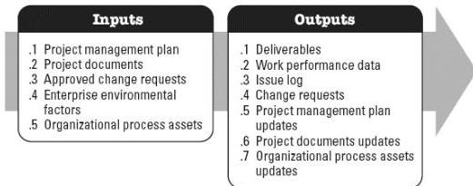

**Figure 4-2. Direct and Manage Project Work: Inputs and Outputs**

The needs of the project determine which components of the project management plan and which project documents are necessary.

#### 4.1.1 PROJECT MANAGEMENT PLAN COMPONENTS

Any component of the project management plan may be an input for this process.

#### 4.1.2 PROJECT DOCUMENTS EXAMPLES

Examples of project documents that may be inputs for this process include but are not limited to:

- ◆ Change log,
- ◆ Lessons learned register,
- ◆ Milestone list,
- ◆ Project communications,
- ◆ Project schedule,
- ◆ Requirements traceability matrix,
- ◆ Risk register, and
- ◆ Risk report.

#### 4.1.3 PROJECT MANAGEMENT PLAN UPDATES

Any component of the project management plan may be updated as a result of this process.

574