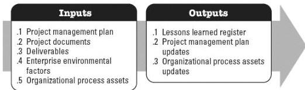

#### 4.1.4 PROJECT DOCUMENTS UPDATES

Project documents that may be updated as a result of this process include but are not limited to:

- ◆ Activity list,
- ◆ Assumption log,
- ◆ Lessons learned register,
- ◆ Requirements documentation,
- ◆ Risk register, and
- ◆ Stakeholder register.

#### 4.2 MANAGE PROJECT KNOWLEDGE

Manage Project Knowledge is the process of using existing knowledge and creating new knowledge to achieve the project's objectives and contribute to organizational learning. The key benefits of this process are that prior organizational knowledge is leveraged to produce or improve the project outcomes and that knowledge created by the project is available to support organizational operations and future projects or phases. This process is performed throughout the project. The inputs and outputs of this process are depicted in Figure 4-3.

**Figure 4-3. Manage Project Knowledge: Inputs and Outputs**

The needs of the project determine which components of the project management plan and which project documents are necessary.

##### 4.2.1 PROJECT MANAGEMENT PLAN COMPONENTS

All components of the project management plan may be inputs for this process.

##### 4.2.2 PROJECT DOCUMENTS

575