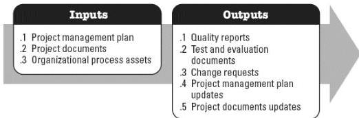

Examples of project documents that may be inputs for this process include but are not limited to:

- ◆ Lessons learned register,
- ◆ Project team assignments,
- ◆ Resource breakdown structure,
- ◆ Source selection criteria, and
- ◆ Stakeholder register.

#### 4.2.3 PROJECT MANAGEMENT PLAN UPDATES

Any component of the project management plan may be updated as a result of this process.

#### 4.3 MANAGE QUALITY

Manage Quality is the process of translating the quality management plan into executable quality activities that incorporate the organization's quality policies into the project. The key benefit of this process is that it increases the probability of meeting the quality objectives, as well as identifying ineffective processes and causes of poor quality. This process is performed throughout the project. The inputs and outputs of this process are shown in Figure 4-4.

**Figure 4-4. Manage Quality: Inputs and Outputs**

The needs of the project determine which components of the project management plan and which project documents are necessary.

#### 4.3.1 PROJECT MANAGEMENT PLAN COMPONENTS

An example of a project management plan component that may be an input for this

576