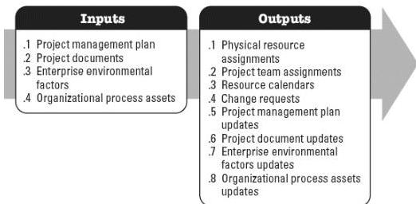

**Figure 4-5. Acquire Resources: Inputs and Outputs**

The needs of the project determine which components of the project management plan and which project documents are necessary.

#### 4.4.1 PROJECT MANAGEMENT PLAN COMPONENTS

Examples of project management plan components that may be inputs for this process include but are not limited to:

- ◆ Resource management plan,
- ◆ Procurement management plan, and
- ◆ Cost baseline.

#### 4.4.2 PROJECT DOCUMENTS EXAMPLES

Examples of project documents that may be inputs for this process include but are not limited to:

- ◆ Project schedule
- ◆ Resource calendars,
- ◆ Resource requirements, and
- ◆ Stakeholder register.

#### 4.4.3 PROJECT MANAGEMENT PLAN UPDATES

Components of the project management plan that may be updated as a result of this

578