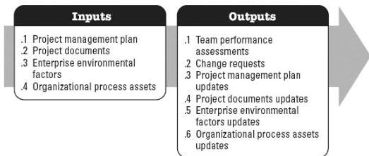

process include but are not limited to:

- ◆ Resource management plan, and
- ◆ Cost baseline.

#### 4.4.4 PROJECT DOCUMENTS UPDATES

Project documents that may be updated as a result of this process include but are not limited to:

- ◆ Lessons learned register,
- ◆ Project schedule,
- ◆ Resource breakdown structure,
- ◆ Resource calendars,
- ◆ Resource requirements,
- ◆ Risk register, and
- ◆ Stakeholder register.

#### 4.5 DEVELOP TEAM

Develop Team is the process of improving competencies, team member interaction, and overall team environment to enhance project performance. The key benefit of this process is that it results in improved teamwork, enhanced interpersonal skills and competencies, motivated employees, reduced attrition, and improved overall project performance. This process is performed throughout the project. The inputs and outputs of this process are shown in Figure 4-6.

Figure 4-6. Develop Team: Inputs and Outputs

579