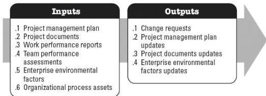

resolving issues, and managing team changes to optimize project performance. The key benefit of this process is that it influences team behavior, manages conflict, and resolves issues. This process is performed throughout the project. The inputs and outputs of this process are shown in Figure 4-7.

Figure 4-7. Manage Team: Inputs and Outputs

The needs of the project determine which components of the project management plan and which project documents are necessary.

#### 4.6.1 PROJECT MANAGEMENT PLAN COMPONENTS

An example of a project management plan component that may be an input for this process includes but is not limited to the resource management plan.

#### 4.6.2 PROJECT DOCUMENTS EXAMPLES

Examples of project documents that may be inputs for this process include but are not limited to:

- Issue log,
- Lessons learned register,
- Project team assignments, and
- Team charter.

#### 4.6.3 PROJECT MANAGEMENT PLAN UPDATES

Components of the project management plan that may be updated as a result of this process include but are not limited to:

- Resource management plan,

581