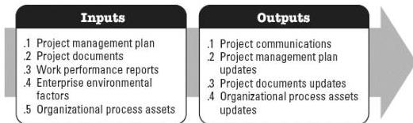

◆ Schedule baseline, and
◆ Cost baseline.

# 4.6.4 PROJECT DOCUMENTS UPDATES

Project documents that may be updated as a result of this process include but are not limited to:

◆ Issue log,
◆ Lessons learned register, and
◆ Project team assignments.

# 4.7 MANAGE COMMUNICATIONS

Manage Communications is the process of ensuring timely and appropriate collection, creation, distribution, storage, retrieval, management, monitoring, and the ultimate disposition of project information. The key benefit of this process is that it enables an efficient and effective information flow between the project team and the stakeholders. This process is performed throughout the project. The inputs and outputs of this process are depicted in Figure 4-8.

Figure 4-8. Manage Communications: Inputs and Outputs

The needs of the project determine which components of the project management plan and which project documents are necessary.

# 4.7.1 PROJECT MANAGEMENT PLAN COMPONENTS

Examples of project management plan components that may be inputs for this process include but are not limited to:

◆ Resource management plan,

582