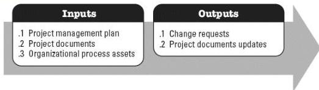

executed as planned in order to address overall project risk exposure, as well as to minimize individual project threats and maximize individual project opportunities. This process is performed throughout the project. The inputs and outputs of this process are depicted in Figure 4-9.

**Figure 4-9. Implement Risk Responses: Inputs and Outputs**

The needs of the project determine which components of the project management plan and which project documents are necessary.

#### 4.8.1 PROJECT MANAGEMENT PLAN COMPONENTS

An example of a project management plan component that may be an input for this process includes but is not limited to the risk management plan.

#### 4.8.2 PROJECT DOCUMENTS EXAMPLES

Examples of project documents that may be inputs for this process include but are not limited to:

- ◆ Lessons learned register,
- ◆ Risk register, and
- ◆ Risk report.

#### 4.8.3 PROJECT DOCUMENTS UPDATES

Project documents that may be updated as a result of this process include but are not limited to:

- ◆ Issue log,
- ◆ Lessons learned register,
- ◆ Project team assignments,
- ◆ Risk register, and

584