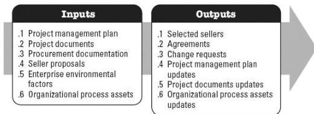

◆ Risk report.

## 4.9 CONDUCT PROCUREMENTS

Conduct Procurements is the process of obtaining seller responses, selecting a seller, and awarding a contract. The key benefit of this process is that it selects a qualified seller and implements the legal agreement for delivery. This process is performed periodically throughout the project as needed. The inputs and outputs of this process are depicted in Figure 4-10.

Figure 4-10. Conduct Procurements: Inputs and Outputs

The needs of the project determine which components of the project management plan and which project documents are necessary.

### 4.9.1 PROJECT MANAGEMENT PLAN COMPONENTS

Examples of project management plan components that may be inputs for this process include but are not limited to:

- ◆ Scope management plan,
- ◆ Requirements management plan,
- ◆ Communications management plan,
- ◆ Risk management plan,
- ◆ Procurement management plan,
- ◆ Configuration management plan, and
- ◆ Cost baseline.

### 4.9.2 PROJECT DOCUMENTS EXAMPLES

585