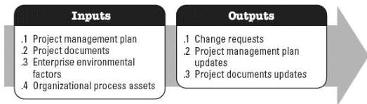

Manage Stakeholder Engagement is the process of communicating and working with stakeholders to meet their needs and expectations, address issues, and foster appropriate stakeholder involvement. The key benefit of this process is that it allows the project manager to increase support and minimize resistance from stakeholders. This process is performed throughout the project. The inputs and outputs of this process are depicted in Figure 4-11.

**Figure 4-11. Manage Stakeholder Engagement: Inputs and Outputs**

The needs of the project determine which components of the project management plan and which project documents are necessary.

#### 4.10.1 PROJECT MANAGEMENT PLAN COMPONENTS

Examples of project management plan components that may be inputs for this process include but are not limited to:

- ◆ Communications management plan,
- ◆ Risk management plan,
- ◆ Stakeholder engagement plan, and
- ◆ Change management plan.

#### 4.10.2 PROJECT DOCUMENTS EXAMPLES

Examples of project documents that may be inputs for this process include but are not limited to:

- ◆ Change log,
- ◆ Issue log,
- ◆ Lessons learned register, and
- ◆ Stakeholder register.

587