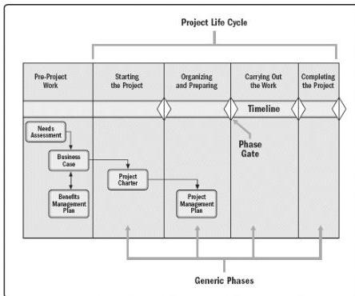

The project sponsor is generally accountable for the development and maintenance of the project business case document. The project manager is responsible for providing recommendations and oversight to keep the project business case, project management plan, project charter, and project benefits management plan success measures in alignment with one another and with the goals and objectives of the organization.

Project managers should appropriately tailor the noted project management documents for their projects. In some organizations, the business case and benefits management plan are maintained at the program level. Project managers should work with the appropriate program managers to ensure the project management documents are aligned with the program documents. Figure 1-8 illustrates the interrelationship of these critical project management business documents and the needs assessment. Figure 1-8 shows an approximation of the life cycle of these various documents against the project life cycle.

Figure 1-8. Interrelationship of Needs Assessment and Critical Business/Project Documents

#### 1.2.6.1 PROJECT BUSINESS CASE

The project business case is a documented economic feasibility study used to establish the validity of the benefits of a selected component lacking sufficient definition and that is used as a basis for the authorization of further project management activities. The business case lists the objectives and reasons for project initiation. It helps measure the project success at the end of the project against the project objectives. The business case is a project

59