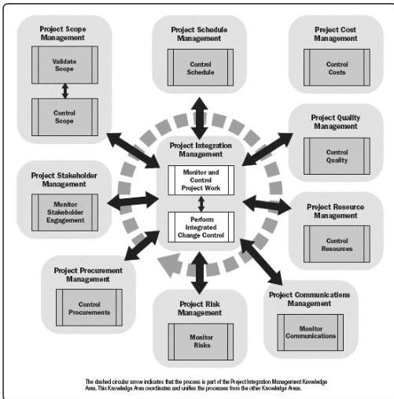

Figure 5-1. Monitoring and Controlling Process Group

## 5.1 MONITOR AND CONTROL PROJECT WORK

Monitor and Control Project Work is the process of tracking, reviewing, and reporting the overall progress to meet the performance objectives defined in the project management plan. The key benefit of this process is that it allows stakeholders to understand the current state of the project, to recognize the actions taken to address any performance issues, and to have visibility into the future project status with cost and schedule forecasts. This process is performed throughout the project. The inputs and outputs for this process are depicted in Figure 5-2.

590