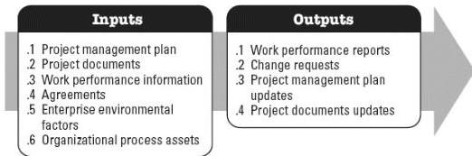

**Figure 5-2. Monitor and Control Project Work: Inputs and Outputs**

The needs of the project determine which components of the project management plan and which project documents are necessary.

### 5.1.1 PROJECT MANAGEMENT PLAN COMPONENTS

Any component of the project management plan may be an input for this process.

### 5.1.2 PROJECT DOCUMENTS EXAMPLES

Examples of project documents that may be inputs for this process include but are not limited to:

- Assumption log,
- Basis of estimates,
- Cost forecasts,
- Issue log,
- Lessons learned register,
- Milestone list,
- Quality reports,
- Risk register,
- Risk report, and
- Schedule forecasts.

### 5.1.3 PROJECT MANAGEMENT PLAN UPDATES

Any component of the project management plan may be updated as a result of this process.

591