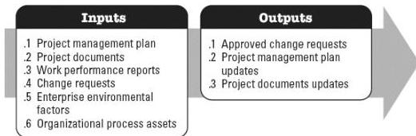

### 5.1.4 PROJECT DOCUMENTS UPDATES

Project documents that may be updated as a result of this process include but are not limited to:

- ◆ Cost forecasts,
- ◆ Issue log,
- ◆ Lessons learned register,
- ◆ Risk register, and
- ◆ Schedule forecasts.

### 5.2 PERFORM INTEGRATED CHANGE CONTROL

Perform Integrated Change Control is the process of reviewing all change requests; approving changes and managing changes to deliverables, organizational process assets, project documents, and the project management plan; and communicating the decisions. This process reviews all requests for changes to project documents, deliverables, or the project management plan, and determines the resolution of the change requests. The key benefit of this process is that it allows for documented changes within the project to be considered in an integrated manner while addressing overall project risk, which often arises from changes made without consideration of the overall project objectives or plans. This process is performed throughout the project. The inputs and outputs of this process are depicted in Figure 5-3.

**Figure 5-3. Perform Integrated Change Control: Inputs and Outputs**

The needs of the project determine which components of the project management plan and which project documents are necessary.

### 5.2.1 PROJECT MANAGEMENT PLAN COMPONENTS

Examples of project management plan components that may be inputs for this process

592