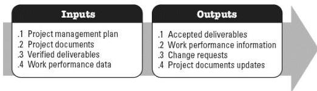

**Figure 5-4. Validate Scope: Inputs and Outputs**

The needs of the project determine which components of the project management plan and which project documents are necessary.

### 5.3.1 PROJECT MANAGEMENT PLAN COMPONENTS

Examples of project management plan components that may be inputs for this process include but are not limited to:

- Scope management plan,
- Requirements management plan, and
- Scope baseline.

### 5.3.2 PROJECT DOCUMENTS EXAMPLES

Examples of project documents that may be inputs for this process include but are not limited to:

- Lessons learned register,
- Quality reports,
- Requirements documentation, and
- Requirements traceability matrix.

### 5.3.3 PROJECT DOCUMENTS UPDATES

Examples of project documents that may be updated as a result of this process include but are not limited to:

- Lessons learned register,
- Requirements documentation, and
- Requirements traceability matrix.

594