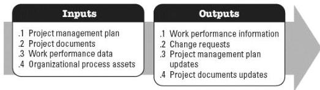

## 5.4 CONTROL SCOPE

Control Scope is the process of monitoring the status of the project and product scope and managing changes to the scope baseline. The key benefit of this process is that the scope baseline is maintained throughout the project. This process is performed throughout the project. The inputs and outputs of this process are depicted in Figure 5-5.

Figure 5-5. Control Scope: Inputs and Outputs

The needs of the project determine which components of the project management plan and which project documents are necessary.

### 5.4.1 PROJECT MANAGEMENT PLAN COMPONENTS

Examples of project management plan components that may be inputs for this process include but are not limited to:

- Scope management plan,
- Requirements management plan,
- Change management plan,
- Configuration management plan,
- Scope baseline, and
- Performance measurement baseline.

### 5.4.2 PROJECT DOCUMENTS EXAMPLES

Examples of project documents that may be inputs for this process include but are not limited to:

- Lessons learned register,
- Requirements documentation, and
- Requirements traceability matrix.

595