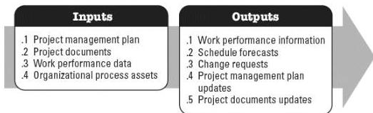

### 5.4.3 PROJECT MANAGEMENT PLAN UPDATES

Components of the project management plan that may be updated as a result of this process include but are not limited to:

- Scope management plan,
- Scope baseline,
- Schedule baseline,
- Cost baseline and
- Performance measurement baseline.

### 5.4.4 PROJECT DOCUMENTS UPDATES

Project documents that may be updated as a result of this process include but are not limited to:

- Lessons learned register,
- Requirements documentation, and
- Requirements traceability matrix.

### 5.5 CONTROL SCHEDULE

Control Schedule is the process of monitoring the status of the project to update the project schedule and manage changes to the schedule baseline. The key benefit of this process is that the schedule baseline is maintained throughout the project. This process is performed throughout the project. The inputs and outputs of this process are depicted in Figure 5-6.

Figure 5-6. Control Schedule: Inputs and Outputs

The needs of the project determine which components of the project management plan and which project documents are necessary.

596