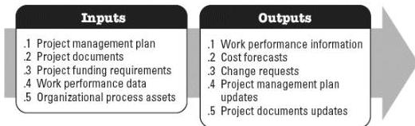

◆ Project schedule,
◆ Resource calendars,
◆ Risk register, and
◆ Schedule data.

# 5.6 CONTROL COSTS

Control Costs is the process of monitoring the status of the project to update the project costs and managing changes to the cost baseline. The key benefit of this process is that the cost baseline is maintained throughout the project. This process is performed throughout the project. The inputs and outputs of this process are depicted in Figure 5-7.

Figure 5-7. Control Costs: Inputs and Outputs

The needs of the project determine which components of the project management plan are necessary.

# 5.6.1 PROJECT MANAGEMENT PLAN COMPONENTS

Examples of project management plan components that may be inputs for this process include but are not limited to:

◆ Cost management plan,
◆ Cost baseline, and
◆ Performance measurement baseline.

# 5.6.2 PROJECT DOCUMENTS EXAMPLES

An example of a project document that may an input for this process includes but is not limited to the lessons learned register.

598