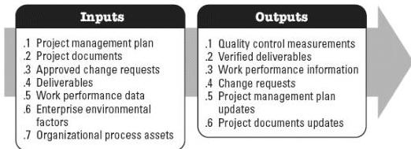

### 5.6.3 PROJECT MANAGEMENT PLAN UPDATES

Components of the project management plan that may be updated as a result of this process include but are not limited to:

- ◆ Cost management plan,
- ◆ Cost baseline, and
- ◆ Performance measurement baseline.

### 5.6.4 PROJECT DOCUMENTS UPDATES

Project documents that may be updated as a result of this process include but are not limited to:

- ◆ Assumption log,
- ◆ Basis of estimates,
- ◆ Cost estimates,
- ◆ Lessons learned register, and
- ◆ Risk register.

## 5.7 CONTROL QUALITY

Control Quality is the process of monitoring and recording results of executing the quality management activities to assess performance and ensure the project outputs are complete, correct, and meet customer expectations. The key benefit of this process is verifying that project deliverables and work meet the requirements specified by key stakeholders for final acceptance. This process is performed throughout the project. The inputs and outputs of this process are shown in Figure 5-8.

Figure 5-8. Control Quality: Inputs and Outputs

599