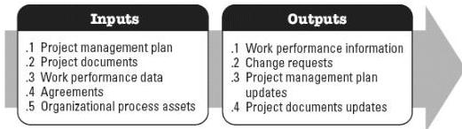

performed throughout the project. The inputs and outputs of this process are shown in Figure 5-9.

**Figure 5-9. Control Resources: Inputs and Outputs**

The needs of the project determine which components of the project management plan and which project documents are necessary.

### 5.8.1 PROJECT MANAGEMENT PLAN COMPONENTS

An example of a project management plan component that may be an input for this process includes but is not limited to the resource management plan.

### 5.8.2 PROJECT DOCUMENTS EXAMPLES

Examples of project documents that may be inputs for this process include but are not limited to:

- Issue log,
- Lessons learned register,
- Physical resource assignments,
- Project schedule
- Resource breakdown structure,
- Resource requirements, and
- Risk register.

### 5.8.3 PROJECT MANAGEMENT PLAN UPDATES

A component of the project management plan that may be updated as a result of this process includes but is not limited to:

- Resource management plan,

601