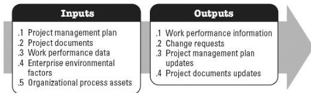

◆ Schedule baseline, and
◆ Cost baseline.

# 5.8.4 PROJECT DOCUMENTS UPDATES

Project documents that may be updated as a result of this process include but are not limited to:

◆ Assumption log,
◆ Issue log,
◆ Lessons learned register,
◆ Physical resource assignments,
◆ Resource breakdown structure, and
◆ Risk register.

# 5.9 MONITOR COMMUNICATIONS

Monitor Communications is the process of ensuring the information needs of the project and its stakeholders are met. The key benefit of this process is the optimal information flow as defined in the communications management plan and stakeholder engagement plan. This process is performed throughout the project. The inputs and outputs of this process are depicted in Figure 5-10.

Figure 5-10. Monitor Communications: Inputs and Outputs

The needs of the project determine which components of the project management plan and which project documents are necessary.

# 5.9.1 PROJECT MANAGEMENT PLAN COMPONENTS

Examples of project management plan components that may be inputs for this process

602