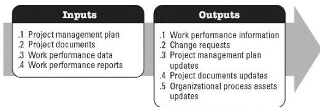

**Figure 5-11. Monitor Risks: Inputs and Outputs**

The needs of the project determine which components of the project management plan and which project documents are necessary.

#### 5.10.1 PROJECT MANAGEMENT PLAN COMPONENTS

An example of a project management plan component that may be an input for this process includes but is not limited to the risk management plan.

#### 5.10.2 PROJECT DOCUMENTS EXAMPLES

Examples of project documents that may be inputs for this process include but are not limited to:

- Issue log,
- Lessons learned register,
- Risk register, and
- Risk report.

#### 5.10.3 PROJECT MANAGEMENT PLAN UPDATES

Any component of the project management plan may be updated as a result of this process.

#### 5.10.4 PROJECT DOCUMENTS UPDATES

Project documents that may be updated as a result of this process include but are not limited to:

- Assumption log,

604