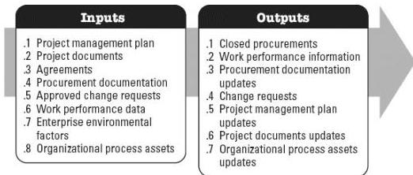

◆ Issue log,
◆ Lessons learned register,
◆ Risk register, and
◆ Risk report.

# 5.11 CONTROL PROCUREMENTS

Control Procurements is the process of managing procurement relationships, monitoring contract performance and making changes and corrections as appropriate, and closing out contracts. The key benefit of this process is that it ensures that both the seller's and buyer's performance meets the project's requirements according to the terms of the legal agreements. This process is performed throughout the project, when procurements are active. The inputs and outputs of this process are depicted in Figure 5-12.

Figure 5-12. Control Procurements: Inputs and Outputs

The needs of the project determine which components of the project management plan and which project documents are necessary.

# 5.11.1 PROJECT MANAGEMENT PLAN COMPONENTS

Examples of project management plan components that may be inputs for this process include but are not limited to:

◆ Requirements management plan,
◆ Risk management plan,
◆ Procurement management plan,
◆ Change management plan, and

605