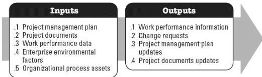

## 5.12 MONITOR STAKEHOLDER ENGAGEMENT

Monitor Stakeholder Engagement is the process of monitoring project stakeholder relationships, and tailoring strategies for engaging stakeholders through modification of engagement strategies and plans. The key benefit of this process is that it maintains or increases the efficiency and effectiveness of stakeholder engagement activities as the project evolves and its environment changes. This process is performed throughout the project. The inputs and outputs of this process are depicted in Figure 5-13.

**Figure 5-13. Monitor Stakeholder Engagement: Inputs and Outputs**

The needs of the project determine which components of the project management plan and which project documents are necessary.

### 5.12.1 PROJECT MANAGEMENT PLAN COMPONENTS

Examples of project management plan components that may be inputs for this process include but are not limited to:

- ◆ Resource management plan,
- ◆ Communications management plan, and
- ◆ Stakeholder engagement plan.

### 5.12.2 PROJECT DOCUMENTS EXAMPLES

Examples of project documents that may be inputs for this process include but are not limited to:

- ◆ Issue log,
- ◆ Lessons learned register,
- ◆ Project communications,
- ◆ Risk register, and
- ◆ Stakeholder register.

607