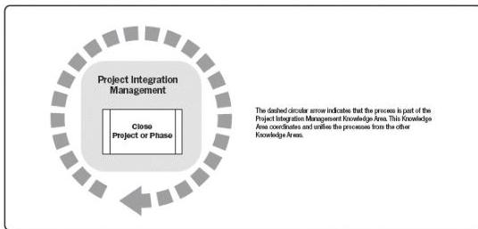

6

# CLOSING PROCESS GROUP

The Closing Process Group consists of the process(es) performed to formally complete or close a project, phase, or contract. This Process Group verifies that the defined processes are completed within all of the Process Groups to close the project or phase, as appropriate, and formally establishes that the project or project phase is complete. The key benefit of this Process Group is that phases, projects, and contracts are closed out appropriately. While there is only one process in this Process Group, organizations may have their own processes associated with project, phase, or contract closure. Therefore, the term Process Group is maintained.

This Process Group may also address the early closure of the project, for example, aborted projects or cancelled projects.

The Closing Process Group (Figure 6-1) includes the project management process identified in Section 6.1.

Figure 6-1. Closing Process Group

# 6.1 CLOSE PROJECT OR PHASE

Close Project or Phase is the process of finalizing all activities for the project, phase, or contract. The key benefits of this process are the project or phase information is archived,

609