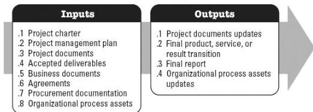

the planned work is completed, and organizational resources are released to pursue new endeavors. This process is performed once or at predefined points in the project. The inputs and outputs of this process are depicted in Figure 6-2.

**Figure 6-2. Close Project or Phase: Inputs and Outputs**

The needs of the project determine which components of the project management plan and which project documents are necessary.

### 6.1.1 PROJECT MANAGEMENT PLAN COMPONENTS

All components of the project management plan may be inputs to this process.

### 6.1.2 PROJECT DOCUMENTS EXAMPLES

Examples of project documents that may be inputs for this process include but are not limited to:

- Assumption log,
- Basis of estimates,
- Change log,
- Issue log,
- Lessons learned register,
- Milestone list,
- Project communications,
- Quality control measurements,
- Quality reports,
- Requirements documentation,
- Risk register, and

610