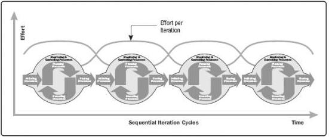

Section 1.2.4.2 of the *PMBOK* *Guide* defines phases as 'a collection of logically related project activities that culminates in the completion of one or more deliverables.' Processes in each of the Process Groups are repeated as necessary in each phase until the completion criteria for that phase have been satisfied.

Projects on the more adaptive side of the continuum make use of two recurring patterns of project phase relationships as described in Sections X3.2.1 and X3.2.2.

## X3.2.1 SEQUENTIAL ITERATION-BASED PHASES

Adaptive projects are often decomposed into a sequence of phases called Iterations. Each iteration utilizes the relevant project management processes. These iterations create a cadence of predictable, timeboxed pre-agreed, consistent duration that aids with scheduling.

Performing the process groups repeatedly incurs overhead. The overhead is considered necessary to effectively manage projects with high degrees of complexity, uncertainty, and change. The effort level for iteration-based phases is illustrated in Figure X3-2.

Figure X3-2. Level of Effort for Process Groups across Iteration Cycles

## X3.2.2 CONTINUOUS OVERLAPPING PHASES

Projects that are highly adaptive will often perform all of the project management process groups continuously throughout the project life cycle. Inspired by techniques from lean thinking, the approach is often referred to as 'continuous and adaptive planning,' which acknowledges that once work starts, the plan will change, and the plan needs to reflect this new knowledge. The intent is to aggressively refine and improve all elements of the project management plan, beyond the prescheduled checkpoints associated with Iterations. The interaction of the Process Groups in this approach is illustrated in Figure X3-3.

656