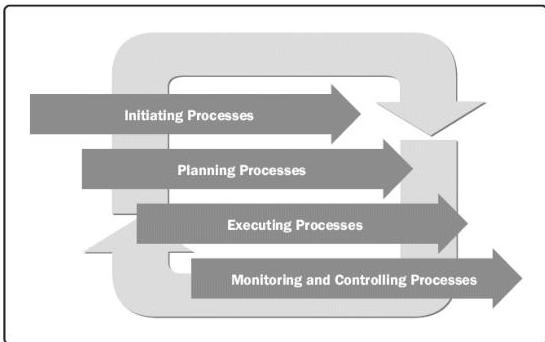

Figure X3-3. Relationship of Process Groups in Continuous Phases

These highly adaptive approaches continuously pull tasks from a prioritized list of work. This aims to minimize the overhead of managing Process Groups repeatedly, by removing the start and end of iteration activities. Continuous pull systems can be viewed as microiterations with an emphasis on maximizing the time available on execution rather than management. They do however need their own planning, tracking, and adjustment mechanisms to keep them on track and adapt to changes.

### X3.3 PROCESS GROUPS IN ADAPTIVE ENVIRONMENTS

As shown in the previous section, each of the Project Management Process Groups occurs in projects across the project life cycle continuum. There are some variations in how the Process Groups interact within adaptive and highly adaptive life cycles.

#### X3.3.1 INITIATING PROCESS GROUP

Initiating processes are those processes performed to define a new project or a new phase of an existing project by obtaining authorization to start the project or phase. Adaptive projects revisit and revalidate the project charter on a frequent basis. As the project progresses, competing priorities and changing dynamics may cause the project constraints and success criteria to become obsolete. For this reason, the Initiating processes are performed regularly on adaptive projects in order to ensure the project is moving within constraints and toward goals that reflect the latest information.

657