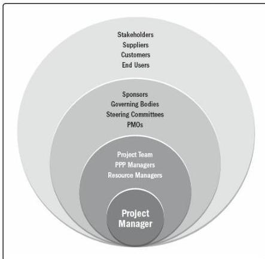

### 3.3.1 OVERVIEW

Project managers fulfill numerous roles within their sphere of influence. These roles reflect the project manager's capabilities and are representative of the value and contributions of the project management profession. This section highlights the roles of the project manager in the various spheres of influence shown in Figure 3-1.

Figure 3-1. Example of Project Manager's Sphere of Influence

### 3.3.2 THE PROJECT

The project manager leads the project team to meet the project's objectives and stakeholders' expectations. The project manager works to balance the competing constraints on the project with the resources available.

The project manager also performs communication roles between the project sponsor, team members, and other stakeholders. This includes providing direction and presenting the vision of success for the project. The project manager uses soft skills (e.g., interpersonal skills and the ability to manage people) to balance the conflicting and competing goals of the project stakeholders in order to achieve consensus. In this context, consensus means that the relevant stakeholders support the project decisions and actions even when there is

79